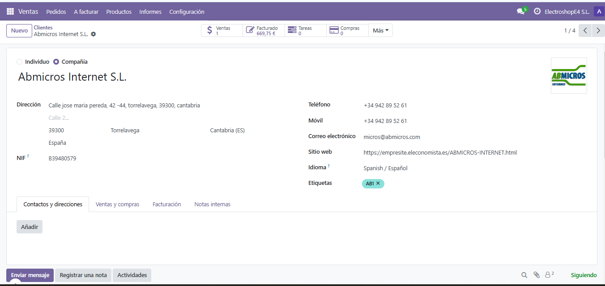

# Usuarios: Alta de Usuarios del Sistema, Empleados, Clientes y Proveedores

## Tabla de Contenidos

1. [Creación de Usuarios del Sistema en Odoo](#1-creación-de-usuarios-del-sistema-en-odoo)  
   - [Paso 1: Acceder al Módulo de Ajustes](#paso-1-acceder-al-módulo-de-ajustes)  
   - [Paso 2: Crear un Nuevo Usuario](#paso-2-crear-un-nuevo-usuario)  
   - [Imágenes de los Usuarios del Sistema](#imágenes-de-los-usuarios-del-sistema)  

2. [Creación de Empleados](#2-creación-de-empleados)  
   - [Paso 1: Acceder al Módulo de Empleados](#paso-1-acceder-al-módulo-de-empleados)  
   - [Paso 2: Crear los Empleados](#paso-2-crear-los-empleados)  
   - [Imágenes de los Empleados](#imágenes-de-los-empleados)  

3. [Creación de Clientes](#3-creación-de-clientes)  
   - [Paso 1: Acceder al Módulo de Facturación](#paso-1-acceder-al-módulo-de-facturación)  
   - [Paso 2: Crear Clientes](#paso-2-crear-clientes)  
   - [Imágenes de los Clientes](#imágenes-de-los-clientes)  

4. [Creación de Proveedores](#4-creación-de-proveedores)  
   - [Paso 1: Acceder al Módulo de Compras](#paso-1-acceder-al-módulo-de-compras)  
   - [Paso 2: Crear Proveedores](#paso-2-crear-proveedores)  
   - [Imágenes de los Proveedores](#imágenes-de-los-proveedores)

---

## 1. Creación de Usuarios del Sistema en Odoo

### Paso 1: Acceder al Módulo de Ajustes

1. **Accede a Odoo** e inicia sesión con tu cuenta de administrador.
2. Ve a **Ajustes** en el menú principal.

### Paso 2: Crear un Nuevo Usuario

1. Dentro del módulo de **Ajustes**, busca la opción **Usuarios y Empresas** y selecciona **Usuarios**.
2. Haz clic en el botón **Crear** para añadir un nuevo usuario.
3. Rellena los siguientes campos:
   - **Nombre**: Ingresa el nombre del usuario, en nuestro caso son: **Ana María Rodríguez Mendez** y **Rimsha**.
4. **Guardar** el usuario.

#### Imágenes de los Usuarios del Sistema:
- Creamos el primer usuario **Ana María Rodríguez Mendez**.
  
  
  
- Creamos el segundo usuario **Rimsha**.
  
  

  
- Aspecto final de los usuarios del sistema.

  

---

## 2. Creación de Empleados

### Paso 1: Acceder al Módulo de Empleados

1. **Accede al módulo de Empleados** desde el menú de Odoo.
2. Dentro del módulo, selecciona la opción **Crear** para añadir un nuevo empleado.

### Paso 2: Crear los Empleados

1. Para crear a **Ana María Rodríguez Mendez**:
   - **Departamento**: Selecciona **Informática**.
   - **Puesto de trabajo**: Asigna **Portavoz**.
   - **Gerente**: Ingresa el nombre de **Ana María Rodríguez Mendez**.
     
2. Para crear a **Laura Alonso Borbolla**:
   - **Departamento**: Selecciona **Informática**.
   - **Puesto de trabajo**: Asigna **Secretaria**.
   - **Gerente**: Ingresa el nombre de **Laura Alonso Borbolla**.
     
3. Para crear a **Mario Fernández Puente**:
   - **Departamento**: Selecciona **Informática**.
   - **Puesto de trabajo**: Asigna **Investigador**.
   - **Gerente**: Ingresa el nombre de **Mario Fernández Puente**.
     
4. Para crear a **Rimsha**:
   - **Departamento**: Selecciona **Ventas**.
   - **Puesto de trabajo**: Asigna **Responsable de Ventas y Productos**.
   - **Gerente**: Ingresa el nombre de **Rimsha**.
     

     
6. #### Imágenes de los Empleados
   Aspecto final de los **empleados**.
   

---

## 3. Creación de Clientes

### Paso 1: Acceder al Módulo de Facturación

1. Desde el menú de Odoo, accede a **Facturación**.
2. Selecciona la opción **Clientes** dentro de Facturación.

### Paso 2: Crear Clientes

1. **Clientes Corporativos**:
   - Para **Abmicros Internet S.L.**:
     -**Dirección**: Calle José María Pereda, 42-44, Torrelavega, 39300, Cantabria
     -**Teléfono**: +34 942 89 52 61
     -**Correo Electrónico**: micros@abmicros.com
     -**Sitio Web**: [ABMICROS](https://empresite.eleconomista.es/ABMICROS-INTERNET.html)
     -**Etiquetas**: AB1
       
   - Para **ENTER SOLUCIONES INFORMÁTOCAS**:
     - **Dirección**: Plaza de las Autonomias, 5 ground floor, 39300, Torrelavega
     - **Teléfono**: 42 808 505
     - **Correo Electrónico**: administracion@entersolucionesinformaticas.com
     - **Sitio Web**: [ENTER SOLUCIONES INFORMÁTOCAS](https://entersolucionesinformaticas.com/enter)
     - **Etiquetas**: ENI1
       

2. **Clientes Individuales**:
   - Para **María Angélica Fernández Roza**:
     - **Dirección**: P.º de Julio Hauzeur, 59, 39300 Torrelavega, Cantabria
     - **Puesto de Trabajo**: Jefa
     - **Teléfono**: 1233456789
     - **Correo Electrónico**: afernandezroza@educantabria.es
       
   - Para **Luis Miguel García Velázquez**:
     - **Dirección**: P.º de Julio Hauzeur, 59, 39300 Torrelavega, Cantabria
     - **Puesto de Trabajo**: Jefé
     - **Teléfono**: +34 942 89 03 16
     - **Correo Electrónico**: lgarciavelazquez@educantabria.es
       

#### Imágenes de los Clientes:
- Aspecto final de los **Clientes**
  

---

## 4. Creación de Proveedores

### Paso 1: Acceder al Módulo de Compras

1. Desde el menú de Odoo, accede a **Compras**.
2. Dentro del módulo, selecciona **Pedidos de Proveedores**.

### Paso 2: Crear Proveedores

1. **Proveedores**:
   - Para **Media Markt**:
     - **Dirección**: Prima Muntadas Building, C/ Solsonés, 2, Puerta C, 08820 - El Prat de Llobregat, Barcelona
     - **Teléfono**: +34 900 205 000
     - **Correo Electrónico**: customerservice@mediamarkt.es
     - **Sitio Web**: [Media Markt](https://www.mediamarkt.es/es)
     - **Etiquetas**: MediaM1
       

   - Para **PC Componentes**:
     - **Dirección**: Avda. Europa, Parcelas 2-5 y 2-6 Polígono Industrial Las Salinas, 30840 Alhama de Murcia
     - **Teléfono**: +34 968 97 79 77
     - **Correo Electrónico**: support@pccomponentes.com
     - **Sitio Web**: [PC Componentes](http://web www.pccomponentes.com)
     - **Etiquetas**: PC1
       

   ###Imágenes de los Proveedores:
   - Aspecto final de los **Proveedore**
     

---

