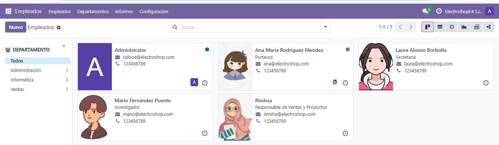

# Usuarios: Alta de Usuarios del Sistema, Empleados, Clientes y Proveedores

## Tabla de Contenidos

1. [Creación de Usuarios del Sistema en Odoo](#creacion-de-usuarios-del-sistema-en-odoo)  
   - [Paso 1: Acceder al Módulo de Ajustes](#paso-1-acceder-al-modulo-de-ajustes)  
   - [Paso 2: Crear un Nuevo Usuario](#paso-2-crear-un-nuevo-usuario)  
   - [Imágenes de los Usuarios del Sistema](#imagenes-de-los-usuarios-del-sistema)  

2. [Creación de Empleados](#creacion-de-empleados)  
   - [Paso 1: Acceder al Módulo de Empleados](#paso-1-acceder-al-modulo-de-empleados)  
   - [Paso 2: Crear los Empleados](#paso-2-crear-los-empleados)  
   - [Imágenes de los Empleados](#imagenes-de-los-empleados)  

3. [Creación de Clientes](#creacion-de-clientes)  
   - [Paso 1: Acceder al Módulo de Facturación](#paso-1-acceder-al-modulo-de-facturacion)  
   - [Paso 2: Crear Clientes](#paso-2-crear-clientes)  
   - [Imágenes de los Clientes](#imagenes-de-los-clientes)  

4. [Creación de Proveedores](#creacion-de-proveedores)  
   - [Paso 1: Acceder al Módulo de Compras](#paso-1-acceder-al-modulo-de-compras)  
   - [Paso 2: Crear Proveedores](#paso-2-crear-proveedores)  
   - [Imágenes de los Proveedores](#imagenes-de-los-proveedores)  

---

## 1. Creación de Usuarios del Sistema en Odoo

### Paso 1: Acceder al Módulo de Ajustes

1. **Accede a Odoo** e inicia sesión con tu cuenta de administrador.
2. Ve a **Ajustes** en el menú principal.

### Paso 2: Crear un Nuevo Usuario

1. Dentro del módulo de **Ajustes**, busca la opción **Usuarios y Empresas** y selecciona **Usuarios**.
2. Haz clic en el botón **Crear** para añadir un nuevo usuario.
3. Rellena los siguientes campos:
   - **Nombre**: Ingresa el nombre del usuario, en nuestro caso son: **Ana María Rodríguez Mendez** y **Rimsha**.
4. **Guardar** el usuario.

#### Imágenes de los Usuarios del Sistema:
- Creamos el primer usuario **Ana María Rodríguez Mendez**.  
    
- Creamos el segundo usuario **Rimsha**.  
    
- Aspecto final de los usuarios del sistema.  
    

---

## 2. Creación de Empleados

### Paso 1: Acceder al Módulo de Empleados

1. **Accede al módulo de Empleados** desde el menú de Odoo.
2. Dentro del módulo, selecciona la opción **Crear** para añadir un nuevo empleado.

### Paso 2: Crear los Empleados

1. Para crear a **Ana María Rodríguez Mendez**:  
   - **Departamento**: Selecciona **Informática**.  
   - **Puesto de trabajo**: Asigna **Portavoz**.  
   - **Gerente**: Ingresa el nombre de **Ana María Rodríguez Mendez**.  
       

2. Para crear a **Laura Alonso Borbolla**:  
   - **Departamento**: Selecciona **Informática**.  
   - **Puesto de trabajo**: Asigna **Secretaria**.  
   - **Gerente**: Ingresa el nombre de **Laura Alonso Borbolla**.  
       

3. Para crear a **Mario Fernández Puente**:  
   - **Departamento**: Selecciona **Informática**.  
   - **Puesto de trabajo**: Asigna **Investigador**.  
   - **Gerente**: Ingresa el nombre de **Mario Fernández Puente**.  
       

4. Para crear a **Rimsha**:  
   - **Departamento**: Selecciona **Ventas**.  
   - **Puesto de trabajo**: Asigna **Responsable de Ventas y Productos**.  
   - **Gerente**: Ingresa el nombre de **Rimsha**.  
       

### Imágenes de los Empleados  
Aspecto final de los **empleados**.  
  

---

## 3. Creación de Clientes

### Paso 1: Acceder al Módulo de Facturación

1. Desde el menú de Odoo, accede a **Facturación**.
2. Selecciona la opción **Clientes** dentro de Facturación.

### Paso 2: Crear Clientes

(Se mantiene la información original, pero con numeración y estructura revisadas)

---

## 4. Creación de Proveedores

### Paso 1: Acceder al Módulo de Compras

1. Desde el menú de Odoo, accede a **Compras**.
2. Dentro del módulo, selecciona **Pedidos de Proveedores**.

### Paso 2: Crear Proveedores

(Se mantiene la información original, pero con numeración y estructura revisadas)

---
