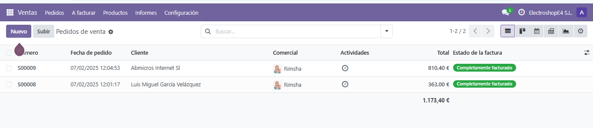
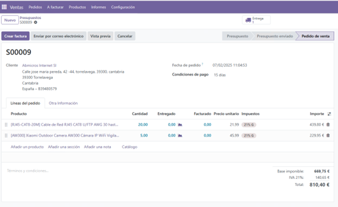
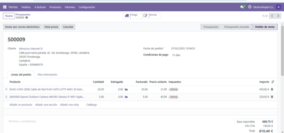
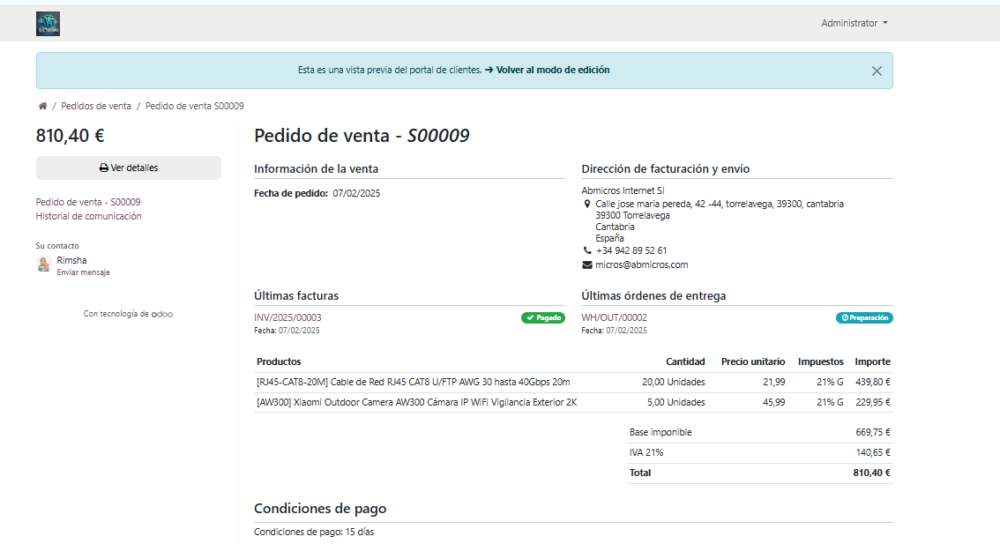
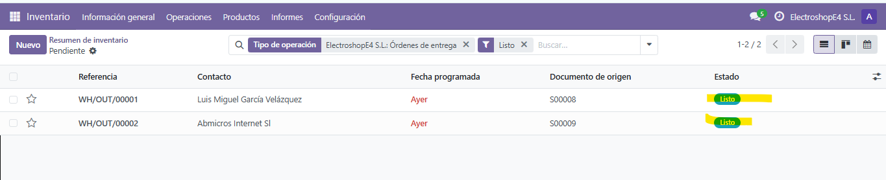
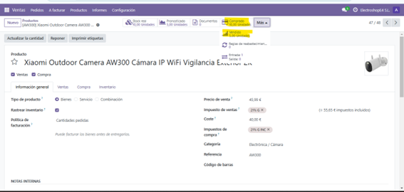

# GESTIÓN DE UNA VENTA - PEDIDOS DE CLIENTES

## Tabla de Contenidos
1. [Introducción](#introducción)
2. [Creación de un Pedido de Venta](#creación-de-un-pedido-de-venta)
3. [Facturación del Pedido](#facturación-del-pedido)
4. [Confirmación de Entrega](#confirmación-de-entrega)
5. [Capturas de Pantalla](#capturas-de-pantalla)
6. [Recursos Adicionales](#recursos-adicionales)

---

## Introducción
En este paso, realizaremos una **venta** en el sistema Odoo. Para ello, utilizaremos productos previamente comprados en el **PASO 4**, creando un **pedido de cliente** desde el módulo de ventas. Posteriormente, procederemos con la facturación y confirmación de entrega.

Realizar un **proceso de ventas eficiente** es crucial para mantener una buena relación con los clientes y garantizar un flujo constante de ingresos. En este paso, aprenderemos cómo gestionar correctamente un pedido, asegurando que los productos vendidos estén correctamente registrados y entregados.

---

## Creación de un Pedido de Venta
### Pasos para crear un pedido:
1. **Acceder al módulo de Ventas** en Odoo.
2. **Ir a "Presupuestos"** y crear un nuevo pedido.
3. **Detalles del pedido:**  
   - **Número de pedido:** S00009  
   - **Cliente:** ABMicros Internet S.L.  
   - **Fecha del pedido:** 07/02/2025  
   - **Condiciones de pago:** 15 días  

4. **Añadir productos:**  
   - **Producto:** RJ45-CAT8-20M (Cable de red RJ45 CAT8 U/FTP AWG 30 hasta...)
     - **Cantidad:** 20 unidades  
     - **Entregado:** 0  
     - **Facturado:** 0  
     - **Precio por unidad:** 21,99€  
     - **Impuesto:** 21%  
   
   - **Producto:** AW300 (Xiaomi Outdoor Camera IP WiFi...)
     - **Cantidad:** 5 unidades  
     - **Entregado:** 0  
     - **Facturado:** 0  
     - **Precio por unidad:** 45,99€  
     - **Impuesto:** 21%  

5. **Resumen de la venta:**  
   - **Base imponible:** 669,75€  
   - **IVA (21%):** 140,65€  
   - **Total:** 810,40€  

6. **Confirmar el pedido** y registrar la venta.

Registrar correctamente los productos vendidos es fundamental para mantener una gestión adecuada del inventario y evitar errores en la facturación.

---

## Facturación del Pedido
Después de crear el pedido, procederemos a su facturación:
1. Acceder al pedido **S00009**.
2. Generar la **factura** con los productos vendidos.
3. Verificar que los productos facturados coinciden con el pedido:
   - **RJ45-CAT8-20M:**
     - **Cantidad facturada:** 20  
     - **Precio por unidad:** 21,99€  
     - **Impuesto:** 21%  
   - **AW300:**
     - **Cantidad facturada:** 5  
     - **Precio por unidad:** 45,99€  
     - **Impuesto:** 21%
       
4. Confirmar la factura y registrar el pago.

  

Un proceso de facturación correcto garantiza que la empresa mantenga un control adecuado sobre sus ingresos y facilite la contabilidad.

---

## Confirmación de Entrega
Una vez facturado el pedido, es necesario gestionar la entrega:
1. Acceder al módulo de **Inventario**.
2. Validar el **envío de productos** al cliente.
3. Confirmar que los productos han sido **entregados correctamente**.
4. Verificar el stock actualizado tras la venta.

Gestionar correctamente la entrega de productos ayuda a evitar retrasos y mejora la experiencia del cliente.

  

---

## Capturas de Pantalla
- **Captura del stock actualizado de Cable RJ45**
  
   
  
- **Captura del stock actualizado de Xiomi Cámara**

  
 

---

## Recursos Adicionales
Para obtener más información sobre el proceso de ventas en Odoo, consulta los siguientes recursos:

- [Visión general del módulo de Ventas en Odoo](https://www.youtube.com/watch?v=Uw3si0nhsPg)
- [Cómo generar un presupuesto de ventas](https://www.youtube.com/watch?v=Hnl_hu8tNb8)
- [Confirmación de un presupuesto y creación de un pedido de ventas](https://www.youtube.com/watch?v=0Dh7DMFF804)
- [Guía oficial de Odoo sobre ventas](https://www.odoo.com/documentation)

---

**Con esto hemos finalizado el proceso de venta en Odoo.** Ahora, nuestro pedido ha sido creado, facturado y entregado con éxito.  
Mantener un flujo de ventas eficiente es clave para el crecimiento de cualquier empresa. ¡Buen trabajo! 
